# Desafio Dio
__Descrição:__ Desenvolver um material de apoio para estudos e futuras implementações. 

Tópicos abordados na sessão *'Primeiros passos com IA'*

---

## Inteligência Artificial

A inteligência artificial é a capacidade tecnológica de simular a inteligência humana, aprendendo por si mesma por meio do processamento de dados.

### • IA Generativa  
Área da inteligência artificial dedicada a gerar conteúdos novos. Esses sistemas são alimentados por **LLMs** (*Large Language Models*), que são um tipo especializado de modelo de aprendizado de máquina (*machine learning*), podendo ser usados para executar tarefas de Processamento de Linguagem Natural (PLN).

- **LLMs (Large Language Models):** modelos de linguagem em grande escala baseados em redes neurais, treinados com uma vasta quantidade de texto. Compreendem e geram texto de forma concisa ao aprender padrões e estruturas linguísticas.

- **Processamento de Linguagem Natural (PLN):** área da inteligência artificial responsável por fazer o computador entender, interpretar e manipular a linguagem humana, seja por texto ou fala, extraindo significado e contexto.

---

## Modelo Transformador

Arquitetura de rede neural que processa os dados de forma sequencial. É a base técnica mais utilizada para criar modelos de IA generativa de texto. Consiste em dois blocos principais:

- **Bloco codificador (encoder):** recebe e processa a entrada.  
- **Bloco decodificador (decoder):** gera a saída com base no processamento da entrada.

### Conceitos fundamentais:
- **Geração de tokens:** etapa de particionamento do texto; o modelo prevê e produz a próxima palavra (token).  

- **Inserções:** formas de entrada e manipulação dos tokens durante o processamento.  

- **Atenção:** mecanismo que permite ao modelo focar em partes específicas da entrada.  

---

## Engenharia de Prompt

Prática relacionada aos modelos transformadores que guia o comportamento da IA. Consiste no processo de escrever, refinar e otimizar *prompts* (entradas) para obter resultados mais precisos. Aplica técnicas para criar e melhorar instruções destinadas a modelos LLMs e outras inteligências artificiais.

---

## Machine Learning (Aprendizado de Máquina)

Um **algoritmo** é um conjunto de instruções que analisa dados para orientar a tomada de decisões de um sistema de inteligência artificial. Os princípios básicos do aprendizado de máquina baseiam-se na exposição da máquina a grandes volumes de dados, permitindo que ela identifique padrões e aprenda a realizar previsões ou classificações sem ser explicitamente programada para isso.

### Tipos de aprendizado de máquina:
- **Aprendizado profundo:** processo em que a máquina aprende por meio de uma rede neural artificial, imitando a estrutura e o funcionamento do cérebro humano.  

---

## Aplicações de IA usando aprendizado de máquina

- **Visão Computacional:** capacidade da IA de interpretar e compreender o mundo por meio de imagens, vídeos e câmeras, extraindo informações relevantes desses dados visuais.
- **Inteligência de Documentos:** habilidade da IA em processar, organizar e extrair informações úteis de grandes volumes de documentos, sejam eles digitais ou físicos.
- **Mineração de Conhecimento:** processo de gerar, extrair e armazenar conhecimento pesquisável a partir de grandes volumes de dados (inclusive não estruturados), para apoiar a tomada de decisões.

---

## IA Responsável

A fim de garantir a ética e a segurança, destacam-se algumas diretrizes essenciais que asseguram a integridade no desenvolvimento e uso de sistemas de inteligência artificial:

- **Imparcialidade:** promove decisões justas e equivalentes para todos.  
- **Confiabilidade e segurança:** assegura que a IA funcione corretamente em diferentes situações e que esteja protegida contra falhas e ataques maliciosos.  
- **Privacidade e segurança:** protege o uso responsável dos dados pessoais do usuário, respeitando sua privacidade.  
- **Inclusão:** promove o acesso a todos, evitando a exclusão de grupos ou comunidades.  
- **Transparência:** facilita o entendimento dos processos de tomada de decisão da IA.  
- **Responsabilidade:** garante a prestação de contas pelas ações e decisões da IA.

---

# Trabalhando com serviços Azure OpenAI

O **Azure OpenAI** é uma solução da Microsoft que integra recursos em nuvem com serviços baseados em LLMs. Oferece uma plataforma para desenvolver e implementar soluções de IA generativa.

## Modelos disponíveis:
- **GPT-4**, **GPT-3.5**, **Embeddings** e **DALL·E**.

## Ferramentas:
- **Azure Speech Studio**  
- **Azure Language Studio**

---

## Azure Speech Studio

>**Speech Studio** é um conjunto de ferramentas com interface gráfica para criar e integrar recursos de fala da IA do Azure aos seus aplicativos.  
*(Fonte: Microsoft)*

### Criando um recurso de fala

**Etapa 1:**  
Na página inicial, clique na barra de pesquisa e digite **"Speech Services"**.
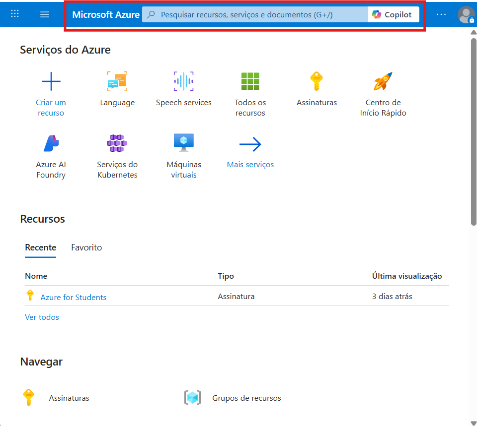
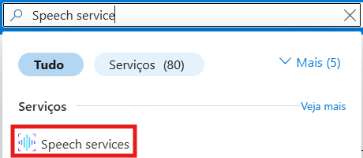

**Etapa 2:**  
Na tela do *Speech Service*, clique em **"Criar um recurso"** (caso ainda não tenha nenhum).
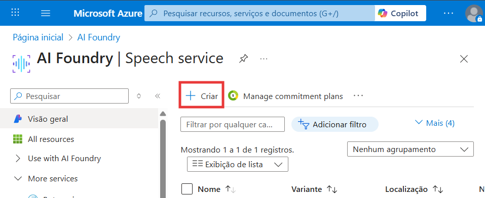

**Etapa 3:**  
Ao abrir a página *Criar Serviços de Fala*, preencha os campos necessários. Depois, clique em **"Examinar + Criar"**.
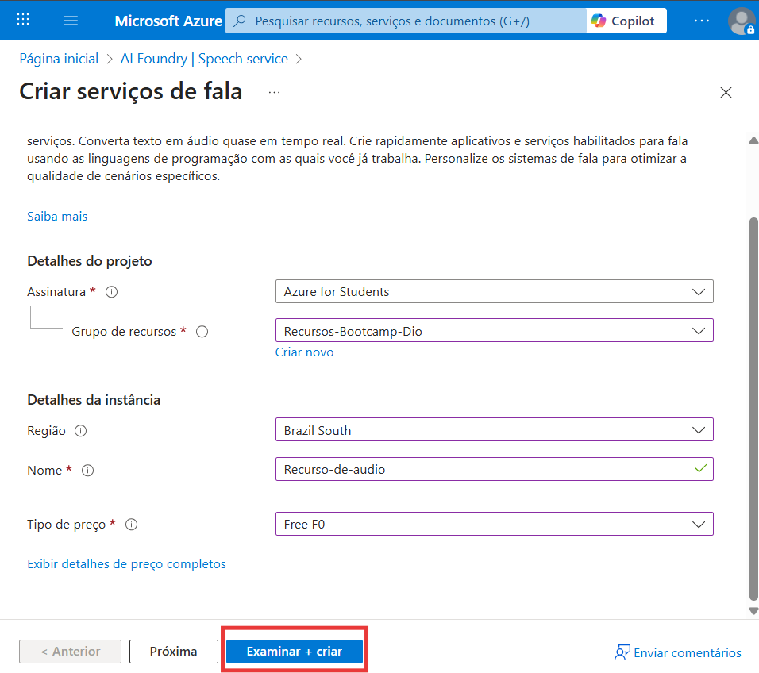

**Etapa 4:**  
Revise as informações e clique em **"Criar"**.
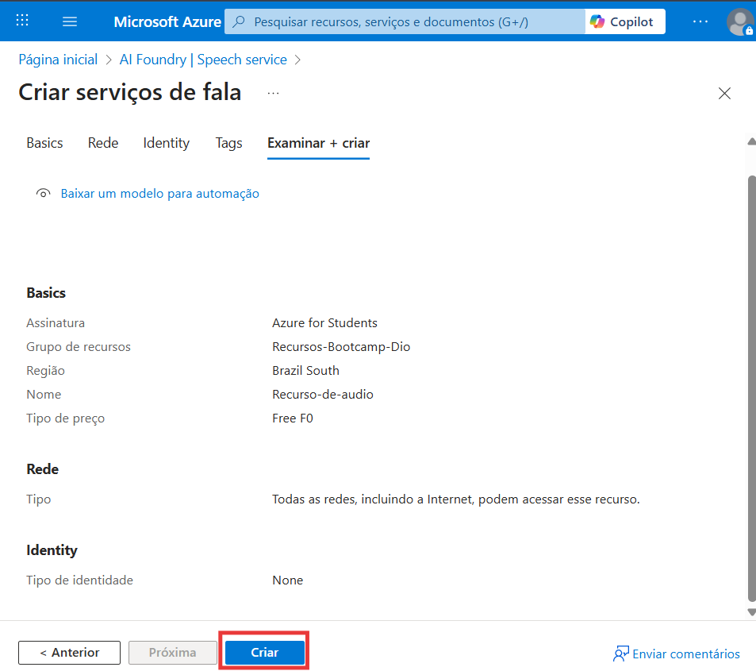

**Etapa 5:**  
Após a criação, acesse a página do [Speech Studio](https://speech.microsoft.com/portal) para utilizar a ferramenta.

### Usando a ferramenta: Conversão de fala em texto

**Etapa 1:**  
Clique em **"Conversão de fala em texto em tempo real"**.
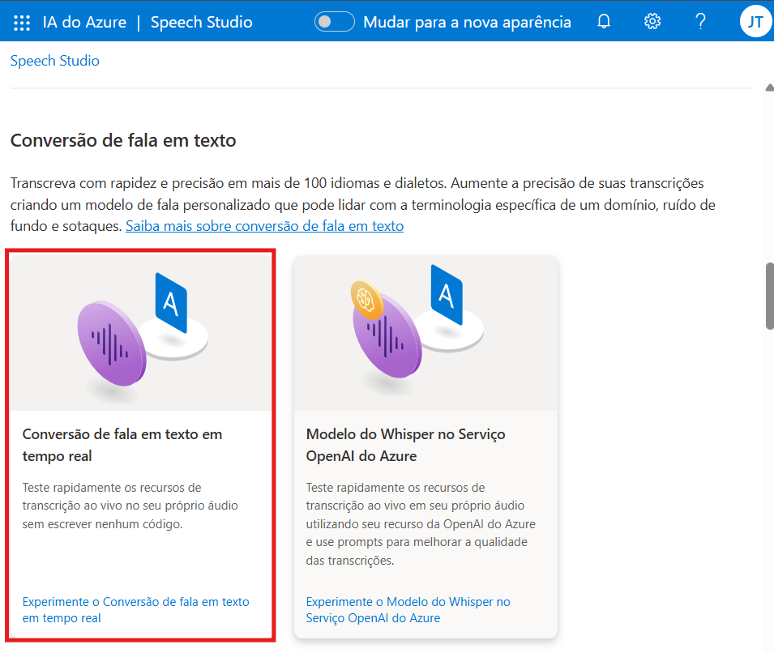

**Etapa 2:**  
Selecione o idioma desejado.
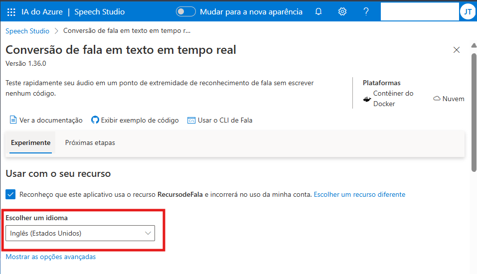

**Etapa 3:**  
Escolha e arraste um arquivo de áudio.
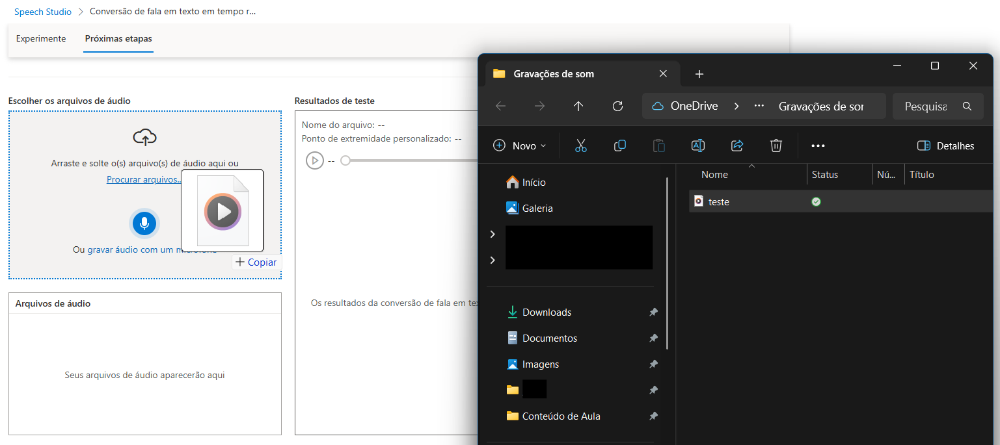

**Etapa 4:**  
Acompanhe a transcrição gerada automaticamente.
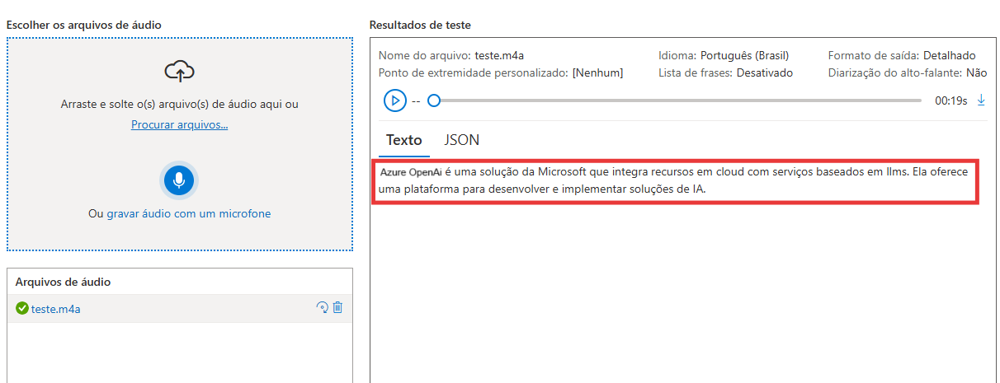

---

## Azure Language Studio

>**Azure AI Language** é um serviço baseado em nuvem que oferece recursos de **Processamento de Linguagem Natural (PLN)** para entender e analisar textos.  
*(Fonte: Microsoft)*

### Criando um recurso de linguagem

**Etapa 1:**  
Na página inicial, clique na barra de pesquisa e digite **"Language"**.
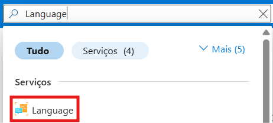

**Etapa 2:**  
Na tela do *Language Service*, clique em **"Criar um recurso"**.
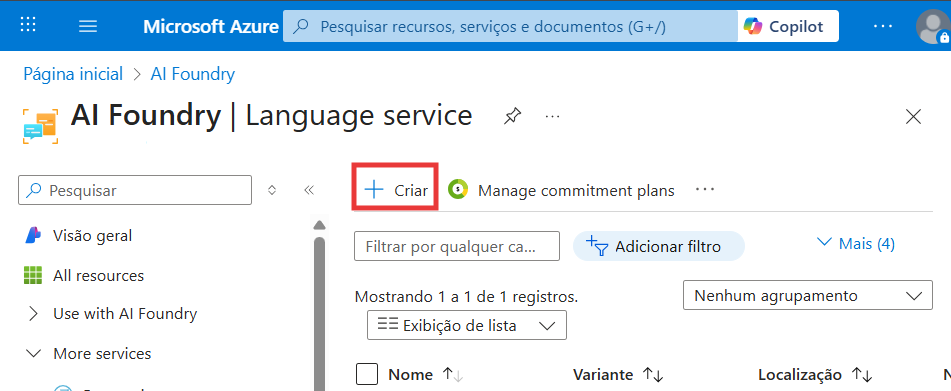

**Etapa 3:**  
Ao abrir a página *Criar Idioma*, preencha os campos e marque a caixa de responsabilidade em **“Aviso de IA Responsável”**.
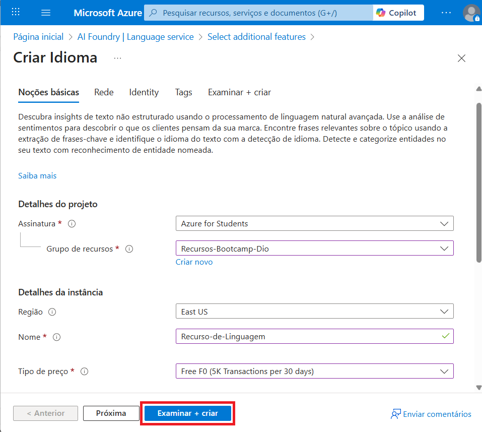
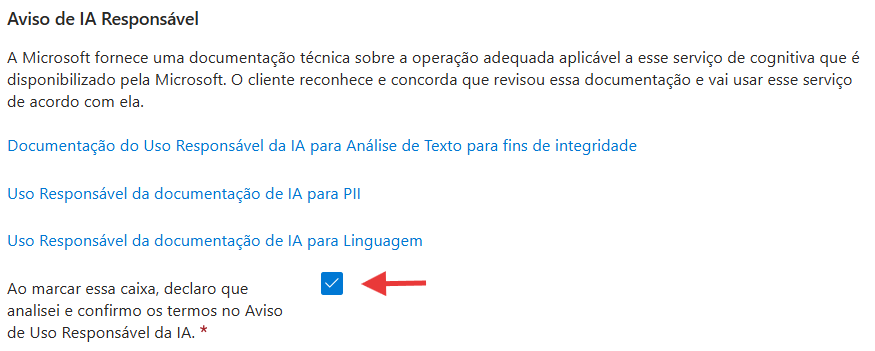
Clique em **"Examinar + Criar"**.

**Etapa 4:**  
Clique em **"Continuar"**.
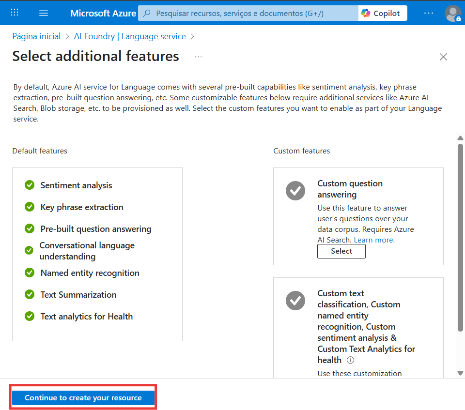

**Etapa 5:**  
Confira se as informações estão corretas e clique em **"Criar"**.
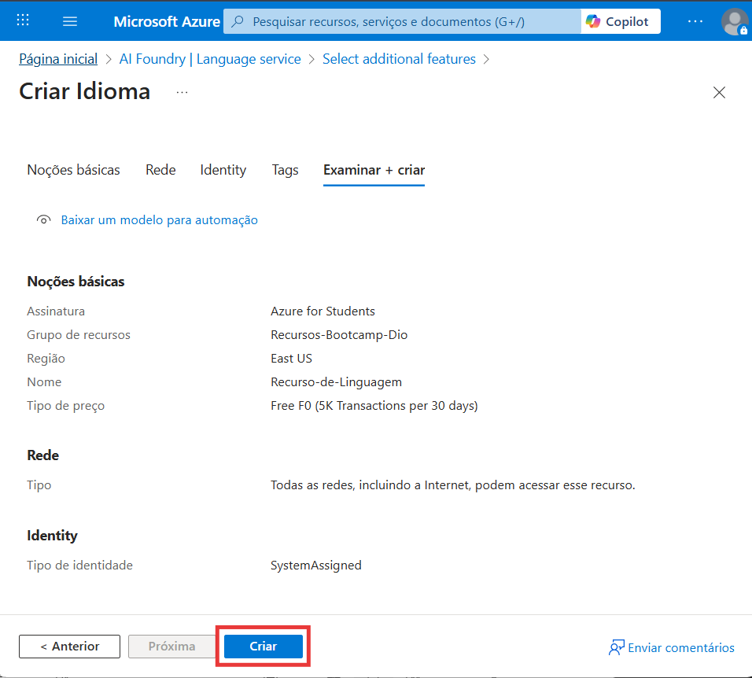

**Etapa 6:**  
Após a criação, acesse a página do [Language Studio](https://language.cognitive.azure.com) para utilizar a ferramenta.

### Usando a ferramenta: Resumir informações

**Etapa 1:**  
Clique em **"Resumir informações"**.

**Etapa 2:**  
Adicione um texto ou envie um arquivo de texto.
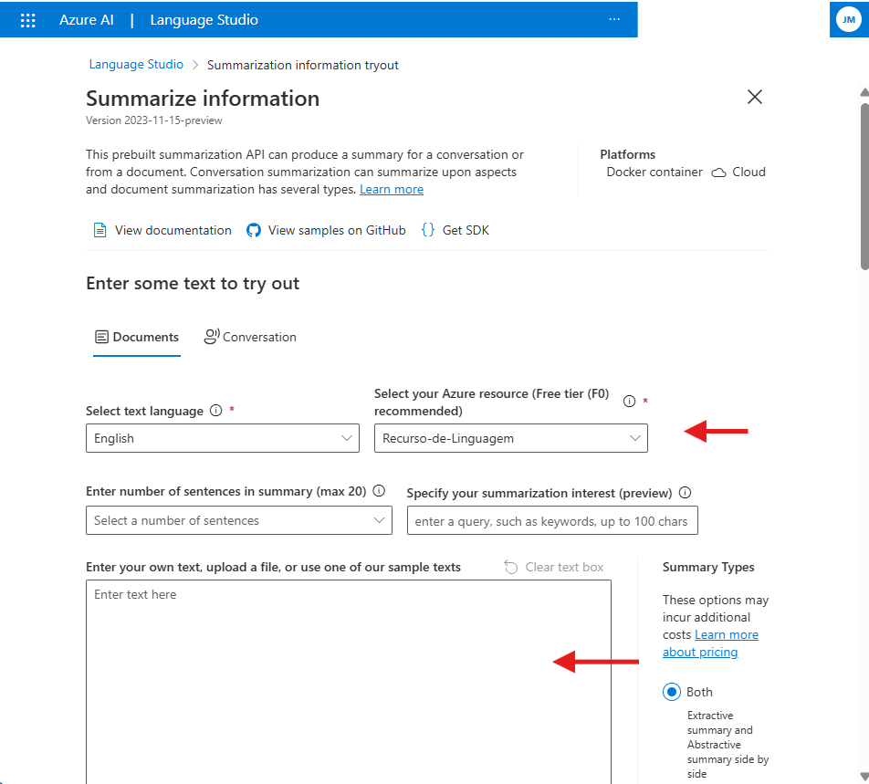
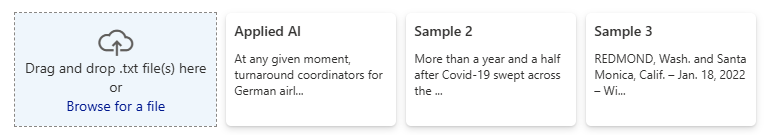

**Etapa 3:**  
Clique em **"Run"** para executar.
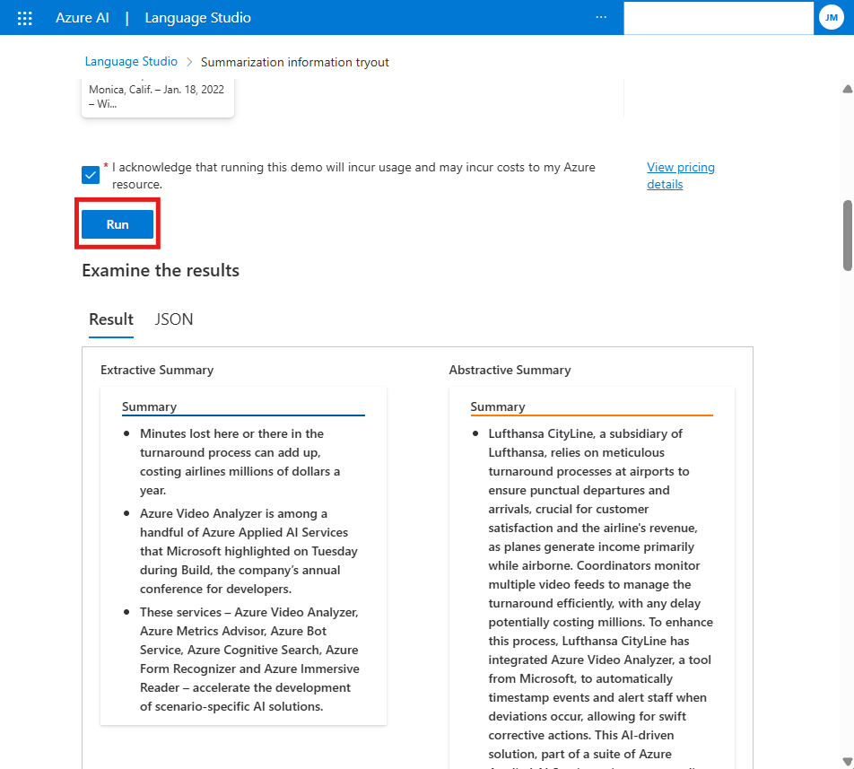
O resultado será exibido no campo “Resultados”, com base na análise feita pela ferramenta.
